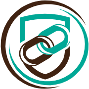

# URL Gathering Tool - Chrome Extension ()

[![Keep a Changelog v1.1.0 badge][changelog-badge]][changelog] 
[![Version 1.1.0 Badge][version-badge]][changelog] 
[![License Badge][license-badge]][license]
[![GitHub issues][github-issue]][issue]
![GitHub commit activity][commit-activity]

By using this chrome extension we can  gather all url that are open on the current browser window and directly copy those information into your clipboard in different format likes, Markdown, CSV, html, and plain text. 


# Chrome Web Store Description


By using this chrome extension we can gather all url that are open on the current browser window and directly copy those information into your clipboard in different format likes, `Markdown`, `CSV`, `html`, `JSON` and `plain text`. 


- Display all icons corresponding to each page that is currently open on the active browser window. It will not takes `chrome` pages likes `chrome://` or `chrome-extension://` into the consideration. The icons appeared on the app as per the corresponding pages open on the browser. 

- Upon clicking an icon, the url corresponds to the page will be copied to your clipboard automatically. The icon corresponds to active page appears on the popup larger than other.  

- Also you will find a `Copy To All` button to copy all urls that are currently open on your active browser window  into your clipboard. Currently we are using a empty line space in between two consecutive url while coping. In the next version we will add an feature so that user can change it as per their requirement.


## Development

In order to deploy this extension into clone the project from this reposotory and run `npm install`. Note that in the [package.json](./package.json) following `scripts` are defined.

```json
"scripts": {
    "dev": "webpack --watch --config webpack.dev.js",
    "build": "webpack --config webpack.prod.js",
    "stat": "webpack --profile --json > webpack-stats.json"
  }
```
The `webpack` module will take care of building and put it into `dist` folder. There are mainly two command we can use here, while developing the extension we use `npm run dev` and for production we generate files using `npm run build`. 

## Boilerplate As Other Chrome Extension
If you want to use this code to create another chrome extension then you can also use this repo as a boilerplate. For that delete all files inside [./src](./src/) folder leaving  only three blank files [contentScript.js](./src/contentScript.js), [serviceWorker.js](./src/serviceWorker.js), and [popup.js](./src/popup.js). Also deletes all files and subfolders inside [./public](./public/) leaving only two blank files [manifest.json](./public/manifest.json) and [popup.html](./public/popup.html). 


<!-- Links -->

[changelog]: ./CHANGELOG.md
[changelog-badge]: https://img.shields.io/badge/changelog-Keep%20a%20Changelog%20v1.1.0-%23E05735
[license]: ./LICENSE
[source]: src/
[pull-request]: https://help.github.com/articles/creating-a-pull-request/
[fork]: https://help.github.com/articles/fork-a-repo/
[version-badge]: https://img.shields.io/badge/version-0.0.2-blue.svg
[license-badge]: https://img.shields.io/github/license/rjanain/url-gathering-chrome-extension
[github-issue]: https://img.shields.io/github/issues/rjanain/url-gathering-chrome-extension
[issue]: https://github.com/rjanain/url-gathering-chrome-extension/issues
[commit-activity]: https://img.shields.io/github/commit-activity/m/rjanain/url-gathering-chrome-extension
